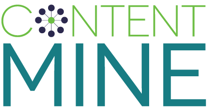

Session OpenCon 2015
==============================

Introduction into the ContentMine project and the software pipeline, followed by a Live-Demo of the fact extraction on the web and the usage of ContentMining to test statistic results in psychology publications.

- Date: 15. November 2015
- Location: Thon Hotel @ Brussels
- Host: [OpenCon 2015](http://www.opencon2015.org/)
- Facilitators: 
	- Jenny Molloy ([@jenny_molloy](https://twitter.com/jenny_molloy?lang=nl))
	- Stefan Kasberger ([@stefankasberger](https://twitter.com/stefankasberger))
	- Ross Mounce ([@rmounce](https://twitter.com/rmounce))
	- Chris Hartgerink ([@chartgerink](https://twitter.com/chartgerink))
- Language: English
- [Pad](http://pads.cottagelabs.com/p/opencon15)
- [Canary Workspace](http://canary.contentmine.org/opencon15)
- [OpenCon](http://opencon2015brussels.sched.org/event/f7984876b7e9af8f929ce1021851b58e?iframe=no&w=i:100;&sidebar=yes&bg=no#.VkbxvHo2xUF)
- [ContentMine.org](http://contentmine.org/events/event/opencon-15-workshop/) 
- hashtag: [#OpenCon](https://twitter.com/hashtag/OpenCon?src=hash)

**ContentMine**
- [ContentMine.org](http://contentmine.org/)
- [@contentmine](http://twitter.com/thecontentmine)
- office@contentmine.org

**Evaluation**

Please take yourself 3mins time to fill out our [Evalutaion form](https://docs.google.com/forms/d/1vJbN97imkD7RuzdYuQeglPl8QYOz1AOKng2TVF4jdvo/viewform) for the session.

**Copyright**

Copyright-holder for all works is the [Shuttleworth Foundation](http://shuttleworthfoundation.org/).
- License for text, slides and images: CC BY 4.0

## Schedule

| Time          | Agenda       | Description                                                            |
|---------------|--------------|------------------------------------------------------------------------|
| 13:00 - 11:15 | Introduction | Introduction into ContentMine.                                         |
| 13:15 - 13:35 | Live-Demo    | Live-Demo of the ContentMine pipeline with canary.                     |
| 13:40 - 13:50 | Statistical tests | Showing the power of CM for testing results in psychology.        |
| 13:50 - 14:00 | Questions    | Open questions from to the audience.                                   |

## Contribute

We're happy you're thinking about contributing to ContentMine!

There are many ways to contribute:
- by reporting an issue regarding software or training
- by starting your own community
- by suggesting new features
- by writing code and documentation
- by closing issues
- by writing about the project

If you have questions, ask us directly or write us a mail (office ett contentmine dot org).

When you are online, you can find us:
- [contentmine.org](http://contentmine.org)
- [@thecontentmine](http://twitter.com/thecontentmine)
- office ett contentmine dot org

## Further materials
- [workshop resources](https://github.com/ContentMine/workshop-resources/)
- [bibJSON](http://okfnlabs.org/bibjson/)
- [Open Bibliography for Science, Technology, and Medicine](http://www.jcheminf.com/content/supplementary/1758-2946-3-47-s1.html): Paper about bibJSON
- [getpapers eupmc queries](https://github.com/ContentMine/workshop-resources/blob/master/software-tutorials/getpapers/getpapers-eupmc-queries.md)
- [getpapers tutorial](https://github.com/ContentMine/workshop-resources/blob/master/software-tutorials/getpapers/getpapers-tutorial.md)
- [Biological classification / taxonomy]https://en.wikipedia.org/wiki/Taxonomy_%28biology%29()
- [EUPMC](https://europepmc.org/)
- [IUCN redlist](http://www.iucnredlist.org/)
- [Fact of the Day 2015-10-28](http://fotd.contentmine.org/?s=daily20151028)

## STRUCTURE
- [README.md](README.md): Overview of repository
- [assets/OpenCon-Slides.odp](assets/OpenCon-Slides.odp): Slides
- [assets/OpenCon-Slides.pdf](assets/OpenCon-Slides.pdf): Slides

